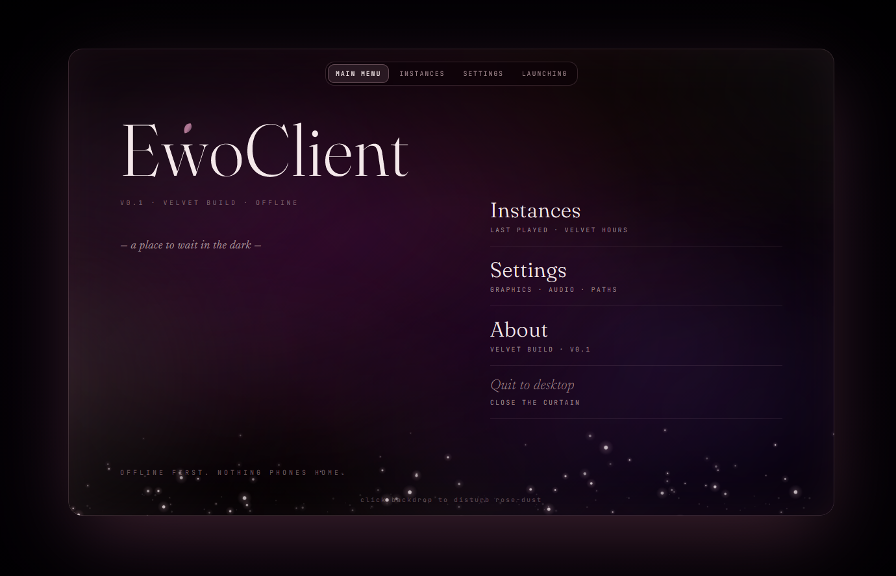
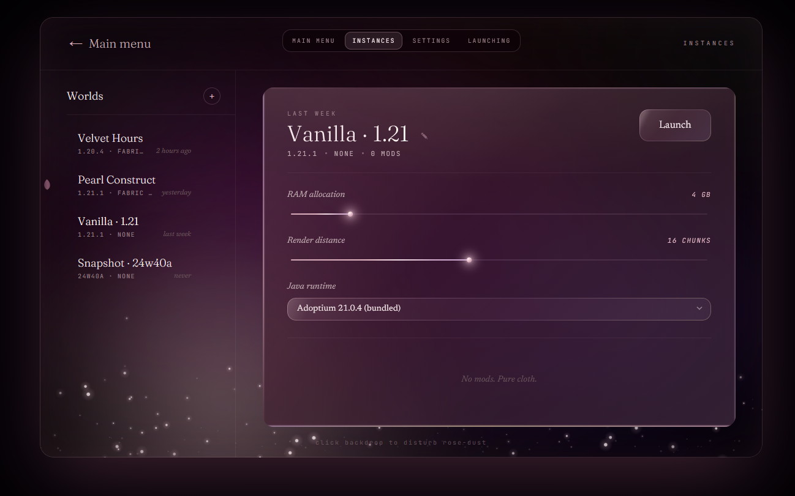
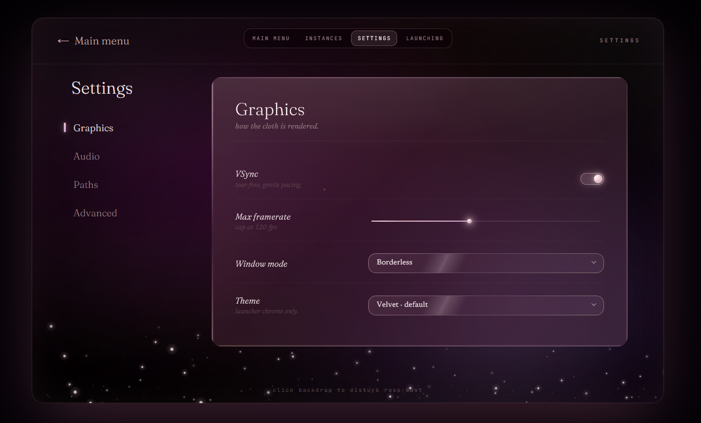
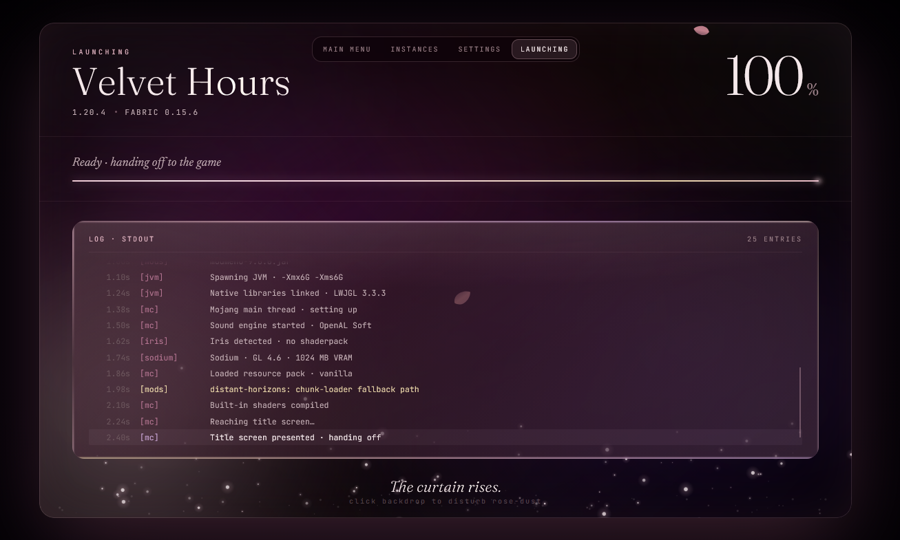

# EwoClient

A custom Minecraft Java Edition launcher with a "Velvet & Pearl" boudoir aesthetic. Native Rust + Skia, custom-frame window, target rendering 500fps on a 500Hz OLED — plus an in-game GUI, a friendly fork of the Fabric loader, and a from-scratch native Minecraft client.

> ⚠️ Personal project. Windows is the developed-and-tested target; Linux/Wayland is written but has never been run on real hardware. macOS and X11 are out of scope.

## Screenshots






## What's done

**The launcher.** A pixel-faithful native port of the CSS prototype — custom-frame transparent window, the full animated backdrop (velvet folds with turbulence + displacement, caustics, bokeh, pearl dust, petals), the glass-panel primitive, every widget and screen, modals, TOML persistence, and a `--dev` overlay with live token tweaks and an FPS HUD.

**It actually launches Minecraft.** Microsoft OAuth → Xbox Live → XSTS → Minecraft Services (the app is on Mojang's allowlist and sign-in is verified live), the real version manifest with sha1-verified library/asset downloads into Mojang's own disk layout, JRE detection with automatic Adoptium fetch, and JVM spawn with stdout/stderr streaming into the launching screen.

**EwoLoader** — a friendly fork of `fabric-loader` (sibling repo) that ships 16 user-toggleable mods plus infrastructure, with per-instance toggles wired end to end.

**An in-game GUI.** A Rust/Skia HUD rendered over the running game from a `cdylib` on its own GL context: FPS/coords/ping/keystrokes/armor/potions/target, a draggable editor, a custom crosshair, an SMTC media controller, a 3D skin viewer, and a multi-tab dashboard — plus client *modules* (12 legit ones by default; a separate `--features pvp` build carries the packet-touching assist set).

**Accounts, profiles and social.** Multi-account, hot-swappable client profiles, a remappable keybind registry, and friends/presence integrated with the user's own Minecraft network.

**[Rewo](REWO_PLAN.md)** — a from-scratch native Minecraft client, in the same workspace under `crates/rewo-*`. It speaks the vanilla protocol (26.2 / protocol 776) and renders with raw Vulkan via `ash`, no JVM and no mod loader. It plays online: signed chat, real skins, OptiFine CEM packs rendered natively, a server-exact client light engine, vanilla's lightmap and day/night sky, per-biome colour, real Nether/End dimensions, 88 mob models with their exact animations, the combat and block-entity arcs, weather and particles — and the whole GUI half: the inventory with its 3D player preview, the first-person hand, 25 container screens, item tooltips and durability bars, the recipe book end to end, and chat — the wrapped, fading HUD box, the screen you type into, a command line with local Brigadier parsing, autocomplete, syntax highlighting and usage hints for every vanilla argument type, translated text (join and death messages and command feedback read as English rather than as `multiplayer.player.joined`), and styled text (a message is a list of styled spans from the wire to the glyph, so a server's colours survive the wrap and bold / italic / underline / strikethrough / obfuscated all draw). Chat is now decorated the way its chat type says (`<Steve> hi`, and a `/msg` in its grey italic), its links are clickable, the command line reports its parse errors, and the scoreboard sidebar draws. Verified headlessly by 34 serverless gate commands, each fail-closed and most with Vulkan validation on, plus a `live --render-check` that drives the *windowed* client against a real server.

## What's next

- **Audio is wired into the client and nobody has listened to it yet.** `crates/rewo-audio` carries the quantisation, the buffer library, the mixer, an SPSC command ring, a cpal sink and (M143) the backend the sound engine drives; `rewo-net` carries the listener transform, the music fade and the `ChannelSink` seam. **The listening pass is the outstanding work and it is a human's.** No gate in this project opens an audio device — an absent, muted, exclusive-mode or unplugged one all look identical from inside the process — so everything a machine can check passes, and that is *not* the same claim.

  ```
  cargo build -p rewo-app --features audio    # a default build links NO audio stack
  rewo live --audio                           # or REWO_AUDIO=1
  cargo run -p rewo-audio --example listen    # one sound, no server
  ```

  The feature is **off by default**, so the 34 gates still link no audio stack for a subsystem none of them exercises, and `rewo live` without it is silent by construction. See [`REWO_AUDIO_PLAN.md`](REWO_AUDIO_PLAN.md).
- **M141** transcribed the ten tickable sound ramps — the per-tick volume/pitch/position curves for bees, elytra, guardians, minecarts, riders, sniffers and the ambient loops — and wired the engine to drive them; **M141d** then fed them their velocity and **M141e–h** built every ordinary trigger, so an elytra, a spawning minecart, a spawning bee, a guardian's beam, a digging sniffer and a mounted rider each start, ramp and stop on their own — seven of the ten. **M142** then built that subsystem — vanilla's three `AmbientSoundHandler`s and the biome/dimension `AmbientSounds` attribute they read — so the world sounds like itself: diving starts an underwater bed that fades out when you surface, a bubble column says which way it drags, and each biome's loop crossfades into the next. Its own finding is that the class name is not the feature: the underwater *handler* plays only the three rare stings, the loop is minted by a rising edge elsewhere, and every piece of that handler's state (a tick delay, four named chance constants) is dead code. Three findings, all of the kind that punish a careful reader: `MinecartSoundInstance` shadows `AbstractSoundInstance.pitch`, so the pitch ramp it declares is dead code and the transcription that reads the class on its own gives every minecart ride a twenty-second glissando vanilla does not have; and a remote entity's `getDeltaMovement()` is a *decaying echo of the last motion packet* rather than a velocity, so a bee gliding steadily past you has its buzz fade to silence while it is visibly moving; and `canPlaySound()` is a per-class override that six of the ten sounds declare and four decline, so binding the elytra to its player — which every other tickable wants — would let a silenced player silence their own wings.
- The chat arc is closed: **M127** shipped the decoration, **M128** clickable chat, **M129** the disconnect reason, **M130** the title's and death screen's style flags (and found the text pass had been handed sRGB bytes by nine of twenty-two callers), **M132** the scoreboard sidebar, **M133** the recipe book's widget tooltips and **M134** the command line's exception messages.
- [`REWO_FEATURE_SURVEY.md`](REWO_FEATURE_SURVEY.md) is the roadmap for features rather than milestones — audit its items against the crates first, since five are already at vanilla parity.
- Hyprland verification for the launcher; a formal pixel-parity pass vs `style/*.png`

([`REWO_PACKET_COVERAGE.md`](REWO_PACKET_COVERAGE.md) is at 118 handled / 0 ignored / 23 absent — 11 not-applicable plus 12 needing a subsystem Rewo lacks, so picking work there means choosing a subsystem rather than a packet. Its table is machine-checked by a unit test in `ids.rs`.)

See [`CLAUDE.md`](CLAUDE.md) for the full design + roadmap, and [`REWO_PLAN.md`](REWO_PLAN.md) for the native client.

## Build

```
cargo run --release -p ewo-launcher           # normal launch
cargo run --release -p ewo-launcher -- --dev  # with dev overlay
cargo run --release -p rewo-app -- live --host … --port …   # the native client
```

Requires Rust stable 1.80+. First build is slow because Skia compiles its own C++ stack (prebuilts are used; ~30s on a recent machine).

## Stack

- **Rust** (single-threaded, no async runtime)
- **Skia** (`skia-safe` 0.78, GL backend) — all 2D rendering
- **winit** 0.30 — windowing, custom frame
- **glutin** 0.32 — GL context
- **taffy** 0.7 — layout primitives
- **ureq** + **tiny_http** + **opener** — Microsoft auth chain (loopback OAuth flow)
- Variable fonts: Fraunces (display), Newsreader (body), JetBrains Mono (mono)
- **ash** 1.3 — raw Vulkan, for the Rewo native client (`crates/rewo-*`)

## License

Source: [MIT](LICENSE).

Bundled fonts are SIL Open Font License (Fraunces, Newsreader, JetBrains Mono) — see `LICENSE` for attribution details.
